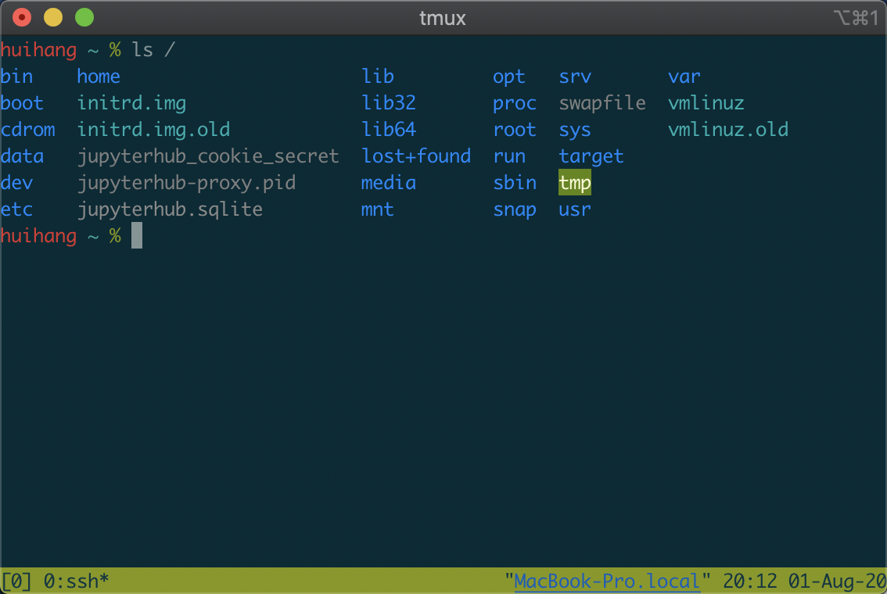
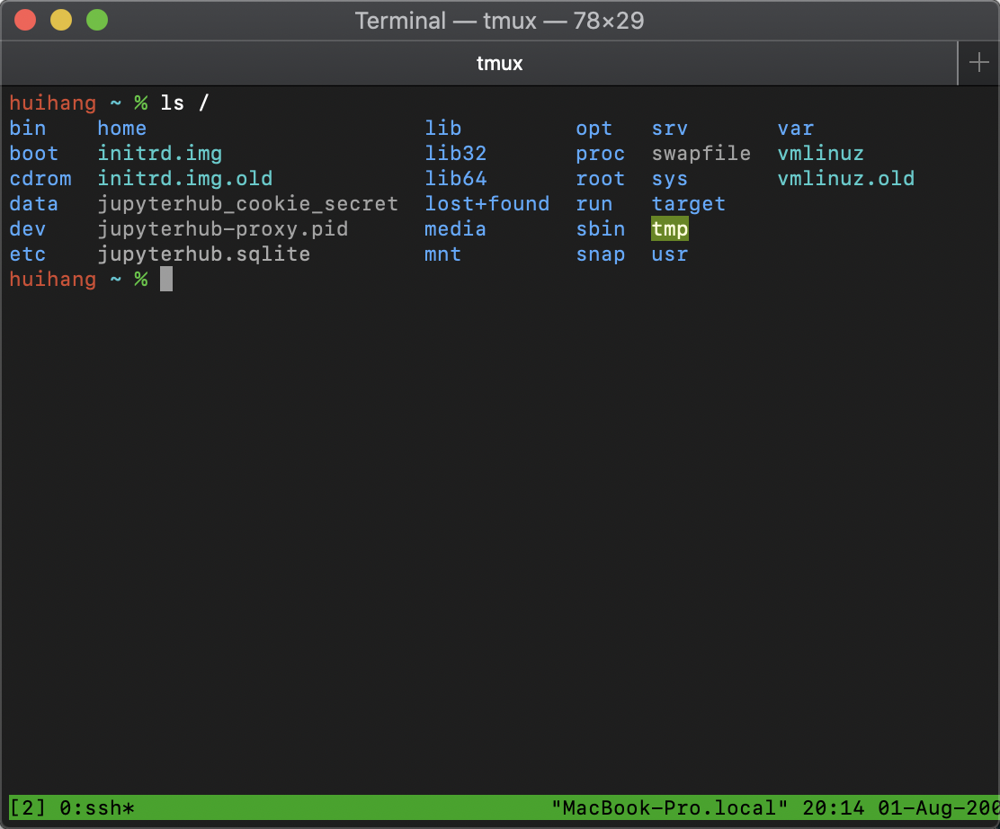
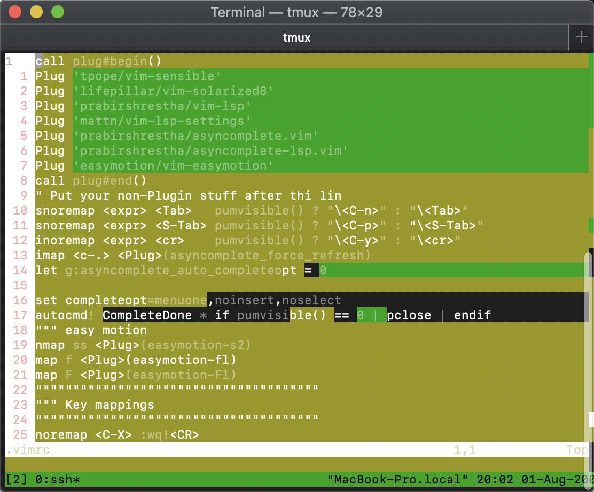
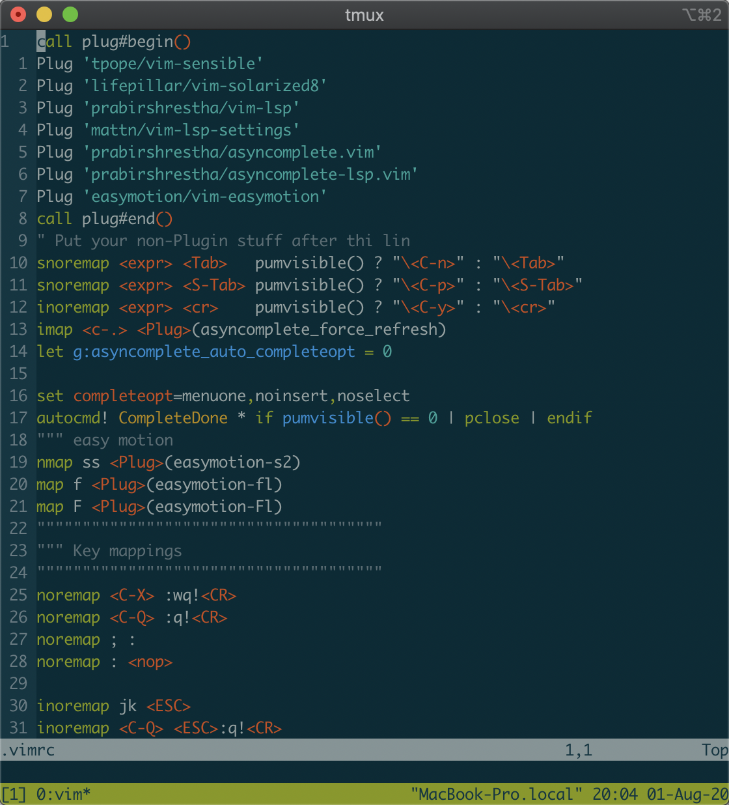

# 显示

1. [Optional] Terminal theme 为[*Solarized*](http://www.baidu.com/link?url=PAJ5bqKnhn1nNk5rnehNeSz7Rp1kX1mhA38LTa9cnbA_fsRhoHQZIb3p_0ptLfCX)。

   Solarized theme的效果

   

   Mac Terminal.app Basic theme的效果

   

2. [Optional future, reqired currently] Terminal 需要支持[TrueColour](https://gist.github.com/XVilka/8346728)，否则`vc`输出颜色混乱。

   正常显示(**若为true color版本，显示效果和Terminal的theme无关**)：

   

# 命令

1. man {command} (**{sth}表示需要相应的sth替换到'{sth}'的位置**)

   查看这个command的manual，绝大多数通用的命令都有manual

   command -h 或 command --help 一些command用这种方式显示帮助文档

2. [z.lua](https://github.com/skywind3000/z.lua)

   `z {相应目录}` 例如`z R` 在默认情况下，他会把你切换到**`z`通过你以往的cd认为的你最想去的路径里包含‘R’的目录**

   `z`命令显示当前`z`的路径权重

3. [fzf](https://github.com/junegunn/fzf)

   `fzf` 列出当前目录下的所有文件，通过键盘动态筛选。**tab**键可以多选，**ctrl-A**多选全部，**ctrl-D**取消全选全部，**ctrl-Q**退出`fzf`。

   `vim {目录} **<tab>`通过`fzf`挑选并打开文件

4. `> {文件名}` 快速浏览文件，q退出

   `< {文件名}`快速新建并写入文件， ctrl-D结束 

# 别名

1. `ll` 列表显示当前目录并彩色输出

2. `v`即`vim`

3. `ta`即`tmux attach`

4. `zb`即`z -b`

   >`"-b"` 选项可以快速回到某一级父目录，避免重复的输入 "cd ../../.."。
   >
   >- **(没有参数)**：`cd` 到项目根目录，即跳转到最近的包含 (.git/.svn/.hg) 的父目录。
   >- **(单个参数)**：`cd` 到离当前目录最近的以关键字开头的父目录，如果找不到就尝试跳到包含关键字的父目录。
   >- **(两个参数)**：将当前路径中的第一个关键词替换为第二个关键词。

# vim

1. insert模式下**jk** 退到normal模式（原本是<ESC>）。
2. **;**进入command line模式 （原本是**:**）。
3. ctrl-Q 强行退出不保存。
4. ctrl-X 强行保存并退出。
5. normal模式下**ss**，然后输入**你要去的位置**的两个字母，再根据红色标示输入字母，完成跳转。